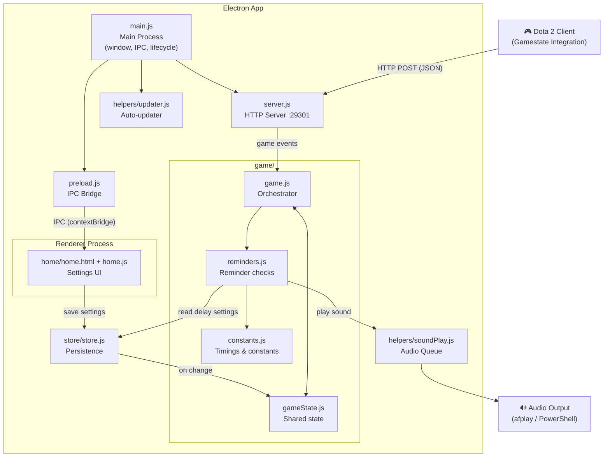

# Dota 2 Reminders


A cross-platform desktop app that listens to your Dota 2 game in real time and plays audio reminders for important timings — stack camps, runes, Roshan, Aegis, and more.

---

## Table of Contents

- [Features](#features)
- [Installation](#installation)
- [How it works](#how-it-works)
- [Project structure](#project-structure)
- [Architecture](#architecture)
- [Contributing](#contributing)
- [Roadmap](#roadmap)
- [License](#license)

---

## Features

| Reminder | Interval | Notes |
|---|---|---|
| Stack | Every 60s | Configurable delay |
| Mid runes | Every 120s | Configurable delay |
| Bounty runes | Every 180s | Configurable delay |
| Smoke | Every 420s | Configurable delay |
| Wisdom runes | Every 420s | Configurable delay |
| Lotus | Every 180s (90s Turbo) | Configurable delay |
| Neutral items | Tiers 1–5 | Fires when each tier becomes available |
| Wards | On shop availability | 30s throttle to avoid spam |
| Day / Night | On transition | — |
| Tower deny | When tower ≤ 10% HP | 15s throttle per lane |
| Roshan | Min & max respawn window | Tracks from kill event |
| Aegis | At 2 min, 30s, 10s, expiry | Tracks from pickup event |
| First Tormentor | At 20:00 | One-time alert |

**Other features:**
- Per-reminder on/off toggle and delay configuration (seconds before the event)
- Global volume control with test sound button
- Turbo mode support (halves Roshan, Aegis, Lotus, and Neutral Item timings)
- Auto-detects when a game starts and stops — no manual activation needed
- Auto-updates silently in the background when no game is running

---

## Installation

### Step 1 — Download the app

Download the latest installer from the release server:

**[https://d2r-electron-server-release.vercel.app](https://d2r-electron-server-release.vercel.app)**

> **Note:** You may see an "untrusted application" warning on Windows. This is expected — code-signing certificates require an annual fee. The app is open source and you can build it yourself if preferred.

---

### Step 2 — Set up Gamestate Integration

The app receives data from Dota 2 via the [Gamestate Integration (GSI)](https://support.overwolf.com/en/support/solutions/articles/9000212745-how-to-enable-game-state-integration-for-dota-2) system.

**This step is handled automatically on first launch.** The installer detects your Steam path and copies the GSI config file to the correct location. You will see a confirmation dialog when it succeeds.

<details>
<summary>Manual setup (if automatic installation failed)</summary>

1. Locate the `gamestate_integration_d2reminders.cfg` file — it is bundled inside the installer ZIP.

2. Find your Steam installation folder. The default location is:
   ```
   C:\Program Files (x86)\Steam
   ```

3. Navigate to the Dota 2 CFG folder:
   ```
   Steam\steamapps\common\dota 2 beta\game\dota\cfg\gamestate_integration\
   ```
   Create the `gamestate_integration` folder if it doesn't exist.

4. Copy `gamestate_integration_d2reminders.cfg` into that folder.


</details>

---

### Step 3 — Run the app

Launch the app before or during a game. It will automatically detect when a match starts.

---

## How it works

Dota 2 sends a JSON payload to a local HTTP server (port `29301`) every game tick via GSI. The app processes each tick, checks the current game time against configured reminder windows, and plays the appropriate MP3 file when a trigger fires.

```
Dota 2  →  HTTP POST (JSON)  →  server.js  →  game.js  →  soundPlay.js  →  speaker
                                                  ↕
                                              store.js  ←  Settings UI (home.html)
```

User settings (which reminders are active, delays, volume) are persisted locally via `electron-store` and synced to the game logic in real time.

---

## Project structure

```
d2r-electron/
│
├── main.js                  # Electron main process — window, IPC handlers, app lifecycle
├── preload.js               # Context bridge — exposes safe IPC APIs to the renderer
├── server.js                # HTTP server on :29301 — receives Dota 2 GSI events
│
├── game/
│   ├── game.js              # Orchestrator — session tracking, event dispatcher
│   ├── reminders.js         # All reminder check functions (one per reminder type)
│   ├── gameState.js         # Shared mutable state for the active game session
│   └── constants.js         # All timing values and magic numbers
│
├── store/
│   └── store.js             # electron-store wrapper — reminder settings + user prefs
│
├── helpers/
│   ├── soundPlay.js         # Audio queue and cross-platform playback (afplay / PowerShell)
│   ├── updater.js           # Auto-updater setup and update-downloaded dialog
│   ├── gsiSetup.js          # First-run GSI config installer (Windows registry + file copy)
│   └── ga4.js               # Google Analytics 4 event tracking
│
├── home/
│   ├── home.html            # Settings UI — toggles, delay inputs, volume slider
│   ├── home.js              # Renderer JS — syncs UI state with electron-store
│   └── home.css             # Styles
│
├── tests/                   # Jest unit tests
│   ├── reminders.test.js    # Timing logic for all reminder types
│   ├── game.test.js         # Event orchestration, deduplication, state tracking
│   └── gsiSetup.test.js     # GSI installer — registry, fallback, file ops
│
├── sound/                   # MP3 files for each reminder
├── assets/                  # App icon and installer assets
└── scripts.o/               # Build scripts and Dota 2 GSI config file
```

---

## Architecture



---

## Contributing

1. Fork the repository and clone it locally
2. Create a branch for your change (`git checkout -b feat/my-feature`)
3. Install dependencies and start the app in development mode:
   ```bash
   npm install
   npm run dev
   ```
4. Run the test suite before pushing:
   ```bash
   npm test
   ```
5. Open a Pull Request against `master` — CI will run the tests automatically and must pass before merging

Releases are handled automatically — merging to `master` triggers the GitHub Actions workflow that builds and publishes a new version.

**To add a new reminder:**
1. Add the timing constant to `game/constants.js`
2. Add the check function to `game/reminders.js`
3. Call it inside `onNewGameEvent` in `game/game.js`
4. Add the MP3 file to `sound/`
5. Add a toggle to `home/home.html` and register it in the default config in `home/home.js`

---

## Roadmap

- [ ] Reminder to use Midas
- [ ] Reminder when an ally is smoked
- [ ] Custom user-defined reminders
- [ ] Optional reminders while spectating
- [ ] App demo and installation video
- [x] Tests

---

## License

MIT License — Copyright (c) 2023 Jordhan Carvalho

Permission is hereby granted, free of charge, to any person obtaining a copy of this software and associated documentation files (the "Software"), to deal in the Software without restriction, including without limitation the rights to use, copy, modify, merge, publish, distribute, sublicense, and/or sell copies of the Software, and to permit persons to whom the Software is furnished to do so, subject to the following conditions:

The above copyright notice and this permission notice shall be included in all copies or substantial portions of the Software.

THE SOFTWARE IS PROVIDED "AS IS", WITHOUT WARRANTY OF ANY KIND, EXPRESS OR IMPLIED, INCLUDING BUT NOT LIMITED TO THE WARRANTIES OF MERCHANTABILITY, FITNESS FOR A PARTICULAR PURPOSE AND NONINFRINGEMENT. IN NO EVENT SHALL THE AUTHORS OR COPYRIGHT HOLDERS BE LIABLE FOR ANY CLAIM, DAMAGES OR OTHER LIABILITY, WHETHER IN AN ACTION OF CONTRACT, TORT OR OTHERWISE, ARISING FROM, OUT OF OR IN CONNECTION WITH THE SOFTWARE OR THE USE OR OTHER DEALINGS IN THE SOFTWARE.
